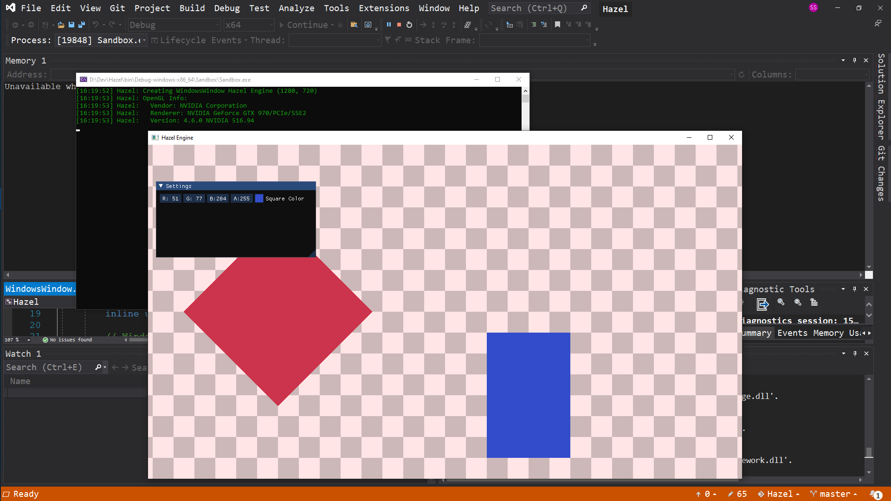
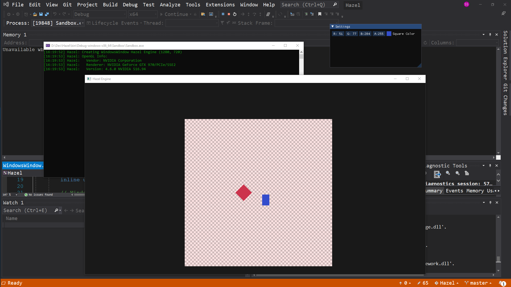

# Hazel
This was I project I followed along with to learn what goes into a game engine. 
I wrote code following along episodes 1-58 of a series by Youtuber "The Cherno", which included topics such as:
* Input
* Windowing
* Graphics - shaders, materials
* 2D Rendering + Cameras
* Event Systems
* ImGUI library
* Profiling
* Build Systems

